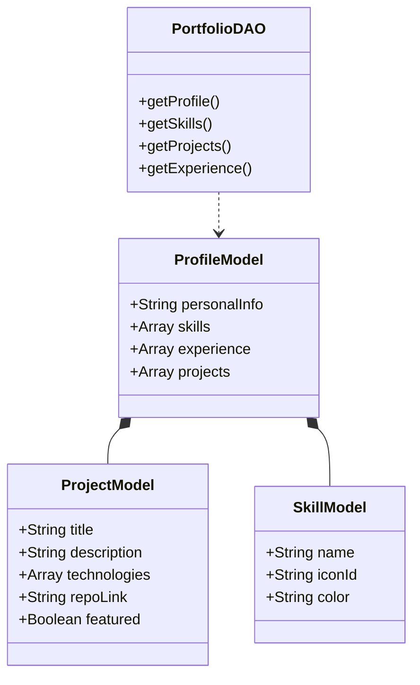

# 🏛️ Portfólio Profissional

Aplicação FrontEnd desenvolvida em **ReactJS** para apresentação de **Perfil Profissional**, **Projetos de Software**, **Experiências Acadêmicas/Profissionais** e **Skills Técnicas**, implementando **Arquitetura Limpa**, **padrões de projeto (DAO/Models)** e **design de alta performance**.

---

## 🌍 Deploy da Aplicação

- 🔗 **FrontEnd (produção):**  
  [https://portfolio-ten-xi-lguafn88c4.vercel.app/](https://portfolio-ten-xi-lguafn88c4.vercel.app/)

---

## 💛 Visão Geral do Projeto

- **Domínio:** Branding Profissional e Engenharia de Software
- **Entidades principais:** Perfil, Projeto, Habilidade, Experiência
- **Objetivo:** Desenvolver uma vitrine técnica pessoal que aplique os conceitos de desenvolvimento moderno, demonstrando domínio em frameworks UI, animações, e organização de código escalável.
- **Persistência:** Data Object Mock / Centralized Data Store (Portfólio Data)

---

## 📜 Tecnologias Utilizadas

### FrontEnd

- **ReactJS 18.2.0** (Engine de UI)
- **JavaScript (ES6+)** (Lógica e Computação)
- **Ant Design (AntD) 5.12.0** (Componentes Enterprise)
- **Tailwind CSS 3.4.0** (Design System e Utilidades)
- **Framer Motion 10.16.4** (Animações e Micro-interações)
- **React Router DOM 6.20.0** (Navegação SPA)
- **Vite 5.0.8** (Build Tool e HMR)

---

# ✨ Funcionalidades Implementadas

O projeto contempla uma aplicação robusta de portfólio com:

- ✅ **Apresentação Hero**: Seção de impacto com gradientes dinâmicos e CTA.
- ✅ **Showcase de Projetos**: Listagem interativa de repositórios e projetos destacados.
- ✅ **Timeline de Experiência**: Visualização cronológica de formação e histórico.
- ✅ **Grid de Habilidades**: Exibição categorizada de stacks técnicas.
- ✅ **Formulário de Contato**: Interface para captação de leads e parcerias.
- ✅ **Dark Mode Nativo**: Suporte profissional a temas escuros.
- ✅ **Arquitetura DAO/Model**: Abstração total da camada de dados.
- ✅ **Performance Otimizada**: Lazy loading de seções pesadas via React.lazy.

---

## 📋 Requisitos Funcionais (RF)

### Perfil e Identidade

- RF01 — Exibir informações básicas (Nome, Título, Localização)
- RF02 — Disponibilizar links de redes sociais (LinkedIn, GitHub)
- RF03 — Permitir download de currículo ou acesso a contato rápido

### Portfólio de Projetos

- RF04 — Listar projetos com título, descrição e tecnologias
- RF05 — Classificar projetos como "Destaques"
- RF06 — Redirecionar para repositórios externos via links seguros

### Habilidades e Skills

- RF07 — Listar habilidades técnicas com ícones representativos
- RF08 — Organizar skills por categorias (Frontend, Ferramentas, etc)

### Experiência e Formação

- RF09 — Exibir timeline de formação acadêmica
- RF10 — Detalhar cursos e certificações relevantes

### Contato

- RF11 — Capturar mensagens via formulário com validação de campos
- RF12 — Oferecer feedback visual de sucesso/erro no envio

---

## ⚙️ Requisitos Não Funcionais (RNF)

- RNF01 — Aplicação desenvolvida em ReactJS com Vite para performance máxima
- RNF02 — Interface construída com Ant Design integrada ao Tailwind CSS
- RNF03 — Código organizado seguindo padrões DAO (Data Access Object) e Models
- RNF04 — Implementação de Lazy Loading para reduzir o First Contentful Paint (FCP)
- RNF05 — Interface 100% responsiva (Mobile First)
- RNF06 — Acessibilidade garantida (Aria Labels, Contraste, Semântica HTML)
- RNF07 — Animações fluidas que não comprometem o Frame Rate
- RNF08 — SEO otimizado com meta-tags e hierarquia de títulos correta

---

# 🧠 Modelagem dos Dados

## 📌 Diagrama de Classes

Abaixo, a representação da estrutura de dados que sustenta a aplicação:



---

## 📌 Entidades e Relacionamentos

### 1. Perfil (ProfileModel)

**Campos:**

- `personalInfo`: Objeto com nome, bio e redes.
- `skills`: Lista de habilidades vinculadas.
- `projects`: Lista de projetos associados ao perfil.

### 2. Projeto (ProjectModel)

**Campos:**

- `title`: Nome do projeto.
- `technologies`: Array de strings/IDs de tecnologias utilizadas.
- `featured`: Booleano para destacar o projeto na UI.

### 3. Habilidade (SkillModel)

**Campos:**

- `name`: Nome da tecnologia.
- `iconId`: Identificador para o sistema de ícones da UI.

---

## 📂 Estrutura do Projeto

```bash
src/
├── components/         # Componentes React
│   ├── common/         # Componentes reutilizáveis (Section, Skeleton)
│   ├── home/           # Seções da página (Hero, About, Projects)
│   └── layout/         # Navbar, Footer e Wrappers
├── daos/               # Abstração de Acesso a Dados
│   └── PortfolioDAO.js
├── models/             # Classes de Definição de Dados
│   └── PortfolioModels.js
├── data/               # Fonte da Verdade (Mock/JSON)
│   └── portfolioData.js
├── pages/              # Páginas da Aplicação (Home)
├── App.jsx             # Estrutura de Rotas e Temas
└── main.jsx            # Entry Point
```

---

## ▶️ Execução Local

### Instalação de Dependências

```bash
# Instalação completa via NPM
npm install
```

### Comandos Disponíveis

| Comando           | Descrição                                                |
| ----------------- | -------------------------------------------------------- |
| `npm run dev`     | Inicia o servidor de desenvolvimento em `localhost:5173` |
| `npm run build`   | Gera o pacote otimizado para produção na pasta `dist/`   |
| `npm run preview` | Executa localmente o build de produção                   |
| `npm run lint`    | Analisa o código em busca de erros e padrões             |

---

## 🎨 Principais Componentes Técnicos

### 1. Sistema de Temas (Ant Design)

Configuração centralizada de tokens de design para garantir consistência visual entre componentes antd e customizados.

### 2. Engine de Animação (Framer Motion)

Uso de `scroll-linked animations` e `layout transitions` para criar uma experiência imersiva sem degradar a performance.

### 3. Camada DAO

Toda a comunicação entre a UI e os dados passa pelo `PortfolioDAO`, permitindo que, no futuro, a fonte de dados possa ser alterada para uma API REST ou Firebase sem impactar os componentes visuais.

---

## 👨‍💻 Autoria

- **Autor:** Nicolas Vitor Pereira Da Paz
- **Stack:** React & Design Systems
- **Especialidade:** Front-end

---

**Desenvolvido com ❤️, técnica e foco em resultados.**
